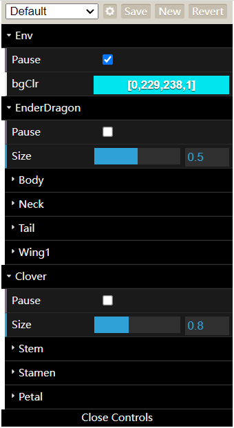
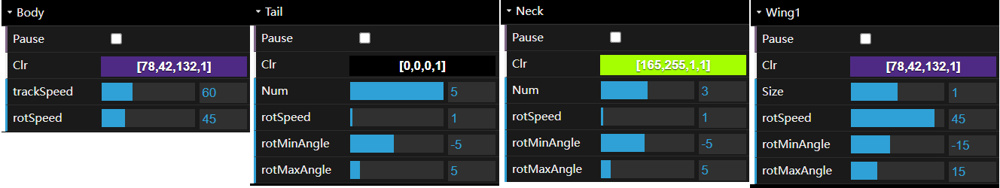
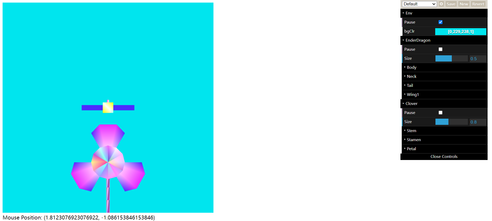
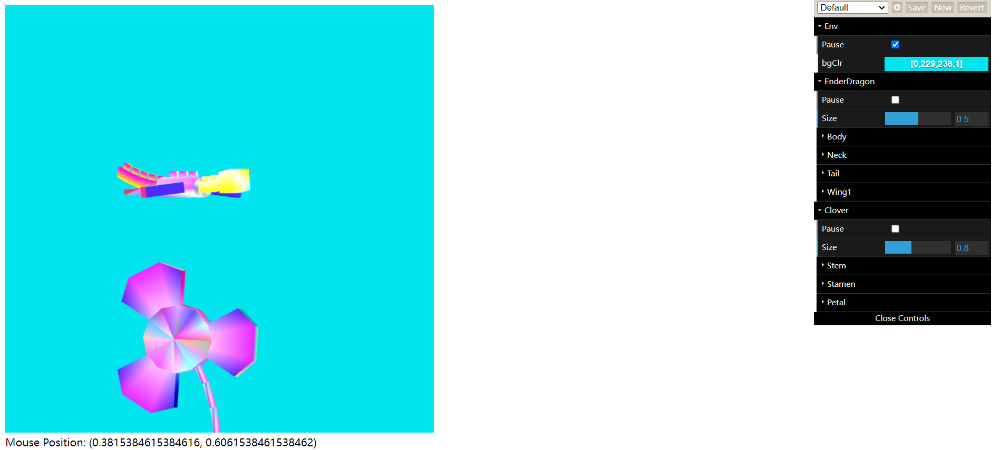
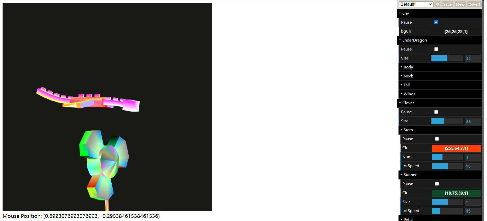
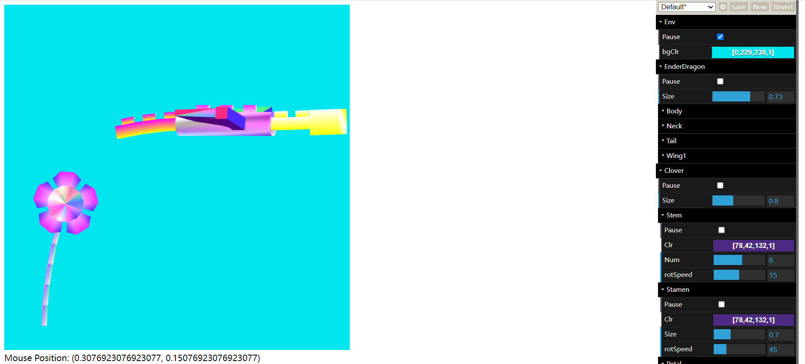
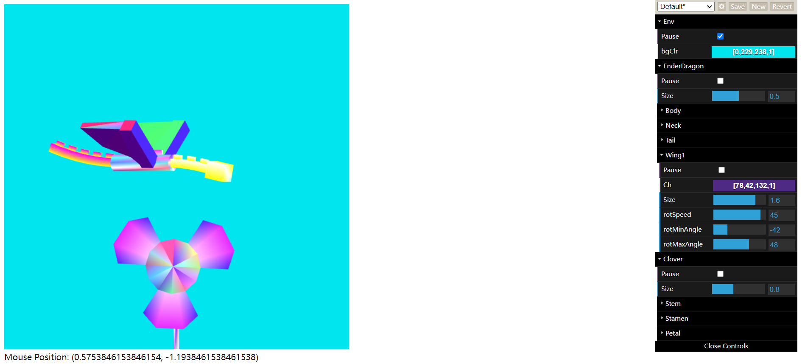

# Project A: The Ender Dragon flying around the Clover

Name: Kuangzheng Zhang
NetID: KZQ6536

## User Guide

explains your goals, and then gives user instructions on how to control the project as it runs

### Goal

The goal of this Project A is to make several different 3D parts (Body, Neck, Head, Wing, Tail, Stem, Stamen, Petal) and assemble them to two 3D assemblies: Ender Dragon and Clover. These assemblies can move smoothly and continuously by itself, but user can also press certain key or move/drag mouse to interact with the scene.

### Introduction

After completely loaded, the user will see the Ender Dragon and the swing Clover. If the user doesn't interact, which means no key pressed and no mouse moved/clicked, the Ender Dragon will fly randomly and the Clover will swing continuously.

#### Help

-   Instructions are presented under canvas
-   Click `Open Control` on the upper right of the web page to open the Control Menu.

#### Control Menu

*Figure 1: Overall Config*

*Figure 2: Ender Dragon Config*

*Figure 3: Clover Config*

Each part can be configured independently. `Pause` is to pause and resume. `Clr` is to change its color. `Num` is to change the segments number of Tail/Stem/Petal. `Size` is to zoom in and out. `rotSpeed` is the rotation speed. `rotMinAngle` and `rotMaxAngle` is to define the range of rotation of Tail/Neck/Wing.

## Instruction

### Keyboard Control

-   /: Toggle Control Menu
-   R: Revert configuration in Control Menu
-   Space: Pause/Resume globally
-   W/&#8593;, S/&#8595;, A/&#8592;, D/&#8594;: Move the position of the Clover

### Mouse Control

-   Move: The Ender Dragon will follow the mouse. It will start to move randomly after reach the mouse
-   Drag & Move: Rotate the Clover

## Results

### Screen Shots

*Figure 4: Initial State*

In the initial state, both Ender Dragon and Clover are paused (`config.Env.Pause = true`)

*Figure 5: Mouse Move Interaction and Free Move*

Once the mouse is inside of canvas, Ender Dragon starts to track mouse continuously. When stop moving mouse and Ender Dragon has reached that mouse position, Ender Dragon will resume moving randomly without user interaction.

*Figure 6: Mouse Drag Interaction and Color Configuration*

User can drag and move Mouse to rotate Clover around Y-axis. The color of every 3D part is configurable. User can change color for Background, Ender Dragon(Body, Neck, Tail, Wing) and Clover (Stem, Stamen, Petal).

*Figure 7: Keyboard Interaction, zoom in/out and Number of segments Configuration*

User can press W/&#8593;, S/&#8595;, A/&#8592;, D/&#8594; on the keyboard to move the position of Clover, change the Size of 3D assembles (Ender Dragon and Clover) to zoom in and out and the number of segments of Necks in Ender Dragon as well as Tails in Clover.

*Figure 8: Ender Dragon Wing Configuration*

User can change the Size of Ender Dragon Wing to zoom only this 3D part in and out,  change `rotMinAngle` and `rotMaxAngle` to adjust the range of angles the wing rotates. The range of `rotMinAngle` and `rotMaxAngle` is both $[-90, 90]$, which means the wing can rotate only in upper plane or lower plane (not only rotate around 0 degree). The program will handle the situation when the user sets `rotMinAngle` > `rotMaxAngle` by changing the other value (`rotMinAngle`/`rotMaxAngle`) accordingly to prevent bug.

### Scene Graph

*Figure 9: Scene Graph*