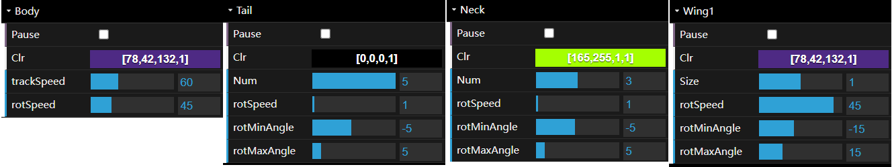
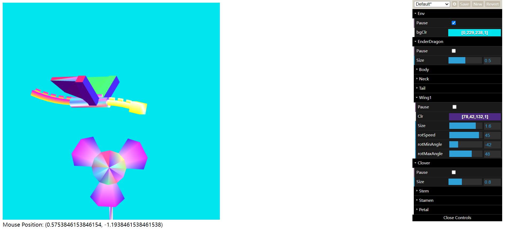

# Project B: The Ender Dragon flying around the Clover in 3D world

Name: Kuangzheng Zhang
NetID: KZQ6536

## User Guide

### Goal

The goal of this Project B is to build a 3D world with Ender Dragon , Clover (Both from my Project A), Torus (From 7.14jt.BasicShapesCam) and Icosahedron and interact with it. The user can see through two different cameras: Perspective Camera and Orthographic Camera. The camera can be moved in three modes: ↑↓←→ (Aim camera in any direction without changing its position), WSAD (Move forward/backward in the gaze direction and strafe sideways left/right) and IKJL (Move along X/Z axis). The Icosahedron can be rotated by mouse dragging.

### Introduction

After completely loaded, the user will see randomly flying Ender Dragon, continuously swing Clover, continuously rotating Torus and stationary Iconsahedron.

#### Help

-   Instructions are presented under canvas
-   Click `Open Control` on the upper right of the web page or press `/` to open the Control Menu.
-   

#### Control Menu

*Figure 1: Overall Config*

*Figure 2: Camera Config*

*Figure 2: Ender Dragon Config*

*Figure 3: Clover Config*

Each part can be configured independently. `Pause` is to pause and resume. `Clr` is to change its color. `Num` is to change the segments number of Tail/Stem/Petal. `Size` is to zoom in and out. `rotSpeed` is the rotation speed. `rotMinAngle` and `rotMaxAngle` is to define the range of rotation of Tail/Neck/Wing.

## Instruction

### Keyboard Control

- /: Toggle Control Menu
- R: Revert configuration in Control Menu
- Space: Pause/Resume globally

### Camera Control
1.  &#8593;, &#8595;, &#8592;, &#8594;: Aim camera in any direction without changing its position
2.  W, S, A, D: Move forward/backward in the gaze direction and strafe sideways left/right
3.  I, K, J, L: Move along X/Z axis

### Mouse Control

Drag & Move: Rotate the Icosahedron

## Results

### Screen Shots

*Figure 4: Initial State*

In the initial state, Torus, Ender Dragon and Clover are paused (`config.Env.Pause = true`)

*Figure 5: Mouse Move Interaction and Free Move*

Once the mouse is inside of canvas, Ender Dragon starts to track mouse continuously. When stop moving mouse and Ender Dragon has reached that mouse position, Ender Dragon will resume moving randomly without user interaction.

*Figure 6: Mouse Drag Interaction and Color Configuration*

User can drag and move Mouse to rotate Clover around Y-axis. The color of every 3D part is configurable. User can change color for Background, Ender Dragon(Body, Neck, Tail, Wing) and Clover (Stem, Stamen, Petal).

*Figure 7: Keyboard Interaction, zoom in/out and Number of segments Configuration*

User can press W/&#8593;, S/&#8595;, A/&#8592;, D/&#8594; on the keyboard to move the position of Clover, change the Size of 3D assembles (Ender Dragon and Clover) to zoom in and out and the number of segments of Necks in Ender Dragon as well as Tails in Clover.

*Figure 8: Ender Dragon Wing Configuration*

User can change the Size of Ender Dragon Wing to zoom only this 3D part in and out,  change `rotMinAngle` and `rotMaxAngle` to adjust the range of angles the wing rotates. The range of `rotMinAngle` and `rotMaxAngle` is both $[-90, 90]$, which means the wing can rotate only in upper plane or lower plane (not only rotate around 0 degree). The program will handle the situation when the user sets `rotMinAngle` > `rotMaxAngle` by changing the other value (`rotMinAngle`/`rotMaxAngle`) accordingly to prevent bug.

### Scene Graph

*Figure 9: Scene Graph*