# Project C: The Ender Dragon flying around the Clover with better lights and materials in 3D world

Name: Kuangzheng Zhang
NetID: KZQ6536

## User Guide

### Goal

The goal of this Project C is to build a more real 3D world by lights and materials with Sphere, Ender Dragon, Clover (Both from my Project A), Torus (From 7.14jt.BasicShapesCam), Icosahedron and interact with it like my Project B. The user can see through two different cameras: Perspective Camera and Orthographic Camera. The camera can be moved in three modes: ↑↓←→ (Aim camera in any direction without changing its position), WSAD (Move forward/backward in the gaze direction and strafe sideways left/right) and IKJL (Move along X/Z axis). The Icosahedron can be rotated by mouse dragging. The lighting & Shading, Light, Material can all be customized to be more realistic.

### Introduction

After completely loaded, the user will see continuously rotating Sphere in the origin with randomly flying Ender Dragon, continuously swing Clover, continuously rotating Torus and stationary Iconsahedron surrounded. Instead of their original color, the surface will show their material and lighting effect.

#### Help

-   Instructions are presented under canvas
-   Click `Open Control` on the upper right of the web page or press `/` to open the Control Menu.
-   Some functions are shown in `Control Menu`-`Camera` and will be illustrated later

#### Control Menu

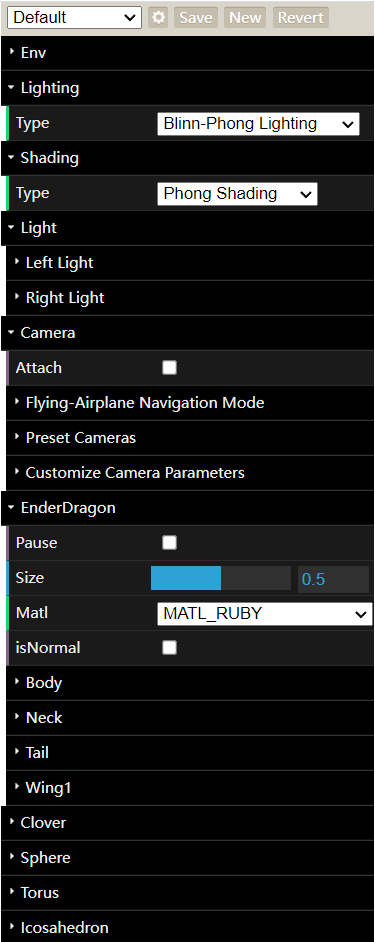

*Figure 1: Overall Config*

*Figure 2: Lighting Config*

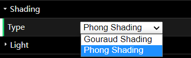

*Figure 3: Shading Config*

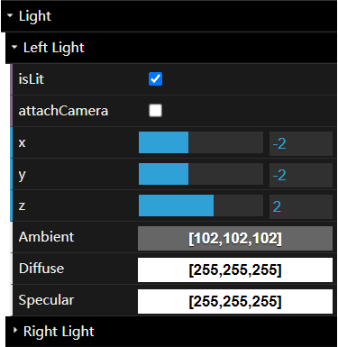

*Figure 4: Light Config*

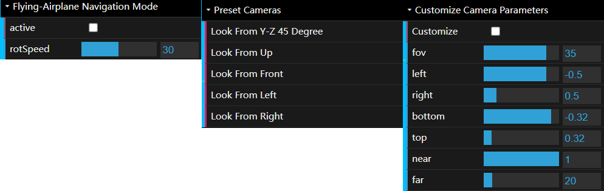

*Figure 5: Camera Config*

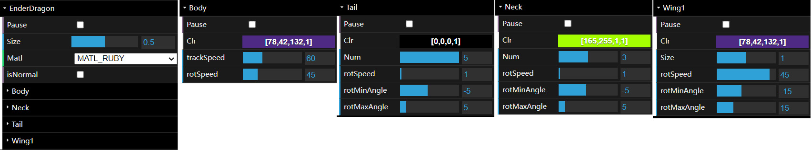

*Figure 6: Ender Dragon Config*

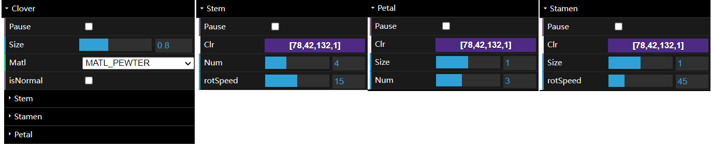

*Figure 7: Clover Config*

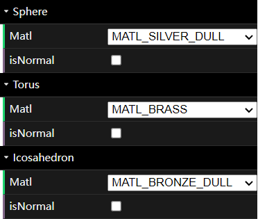

*Figure 8: Sphere/Torus/Icosahedron Config*

**Lighting&Shading Config**: The user can set Lighting to `Phong Lighting`/`Blinn-Phong Lighting` and Shading to `Phong Shading`/`Gouraud Shading` in `Control Menu`-`Lighting`/`Shading`-`Type`, which will result in four different combinations.

**Light Config**: `isLit` is to turn off/on the corresponding light. `attachCamera` is to set the location of the light to the camera, which results in the specular highlight stay in the middle of the sphere as the camera moves. `x`, `y`, `z` is to change the location of the light. `Ambient`, `Diffuse`, `Specular` is to change the color of different components of the light.

**Camera Config**: The user can activate Flying-Airplane Navigation Mode, use Preset Cameras to verify certain functions and customize Camera Parameters.

**Ender Dragon/Clover Config**: Each part can be configured independently. `Matl` is to set their surface material. `isNormal` is to show their original color. `Pause` is to pause and resume. `Clr` is to change its color. `Num` is to change the segments number of Tail/Stem/Petal. `Size` is to zoom in and out. `rotSpeed` is the rotation speed. `rotMinAngle` and `rotMaxAngle` is to define the range of rotation of Tail/Neck/Wing.

**Sphere/Torus/Icosahedron Config**: Only material and toggle whether to show their original color are configurable.

## Instruction

### Keyboard Control

- /: Toggle Control Menu
- R: Revert configuration in Control Menu
- Space: Pause/Resume globally

### Camera Control
1.  &#8593;, &#8595;, &#8592;, &#8594;: Aim camera in any direction without changing its position
2.  W, S, A, D: Move forward/backward in the gaze direction and strafe sideways left/right
3.  I, K, J, L: Move along X/Z axis

### Mouse Control

Drag & Move: Rotate the Icosahedron (Please choose different `Preset Cameras` like `Up`, `Front`, `Left`, `Right` in `Control Menu`-`Camera` to verify whether the rotation is correct).

## Results

### Screen Shots

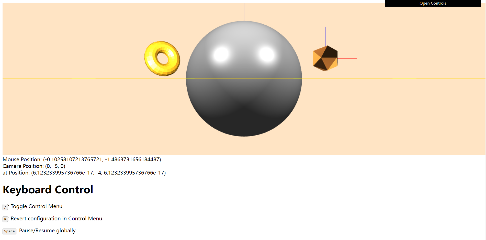

*Figure 9: Initial State*

In the initial state, Ender Dragon, Clover, Sphere, Torus and Icosahedron are all showing their own material. Lighting is set to `Blinn-Phong Lighting`. Shading is set to `Phong Shading`. Two lights are all lighting.

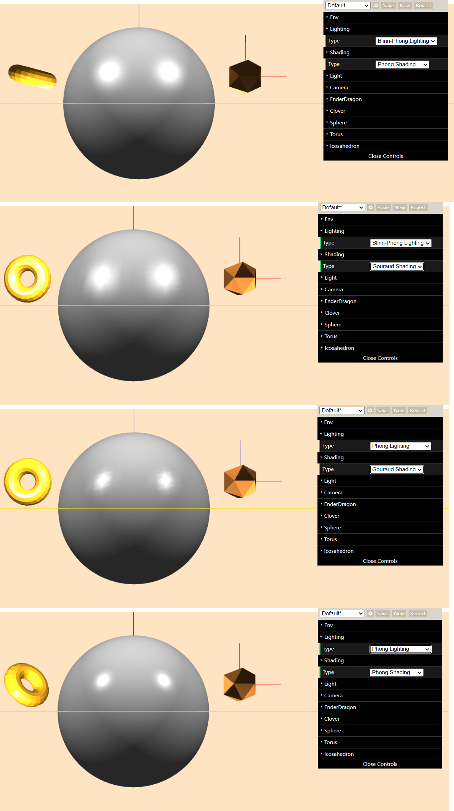

*Figure 10: Lighting&Shading*

Four different combinations of Lighting and Shading: `Blinn-Phong Lighting + Phong Shading`, `Blinn-Phong Lighting + Gouraud Shading`, `Phong Lighting + Phong Shading`, `Phong Lighting + Gouraud Shading`.

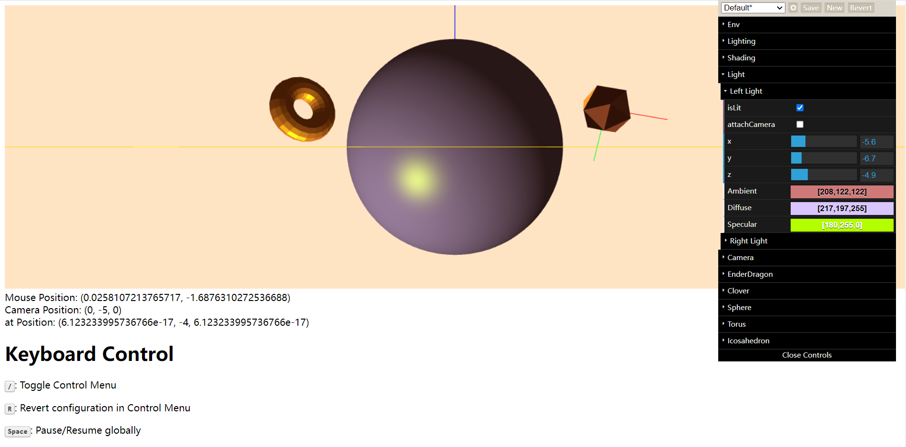

*Figure 11: Light*

Turn off the Right Light to better view the outcome when adjusting Light parameters. The user can adjust the light position and Ambient, Diffuse, Specular color.

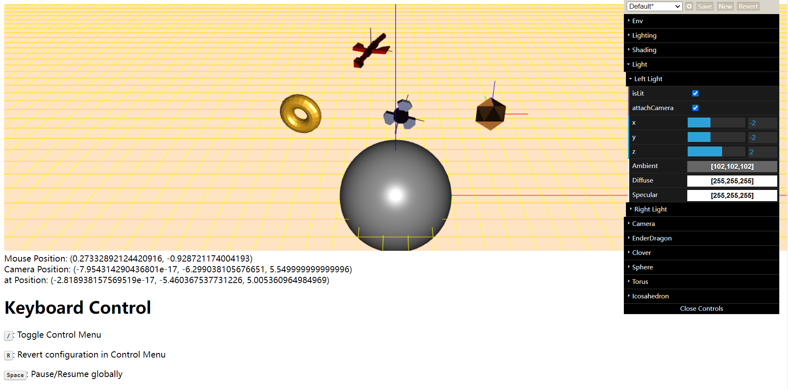

*Figure 12: Headlight Mode*

The user can enable Headlight Mode in `Control Menu`-`Light`-`Left/Right Light`-`attachCamera`. The location of the light will be set to the camera, which results in the specular highlight stay in the middle of the sphere as the camera moves.

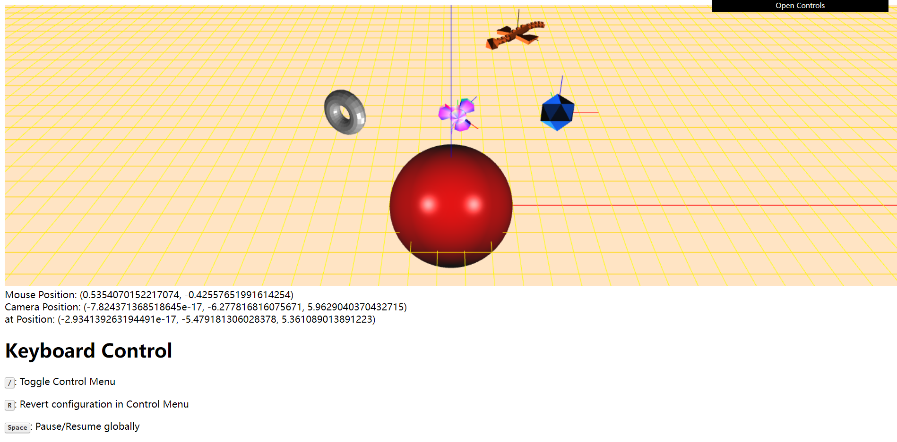

*Figure 13: Material Adjust and Original Color Toggle*

Every 3D object have its own adjustable material and can toggle between their original color and the material.

All other functions in my Project A and B are available.

**User Adjustable Camera Parameters**: The user can customize camera parameters when enabling `Control Menu`-`Camera`-`Customize Camara Parameters`-`Customize`. `fov` will be ignored in this function because the user will adjust `left`, `right`, `bottom`, `top`, `near`, `far`. Other parameters except `near` and `far` will be modified automatically when customizing one parameter to prevent distortion.

**Keyboard Control**: Please see Instruction Section

**No distortion when resizing the window**: The content will never squash/stretch as the user re-size window for taller or wider images of any size. And will never invoke browser horizontal slider-bar (vertical slider-bar will appear because user instruction in web page is a bit long).

### Scene Graph

*Figure 14: Scene Graph*