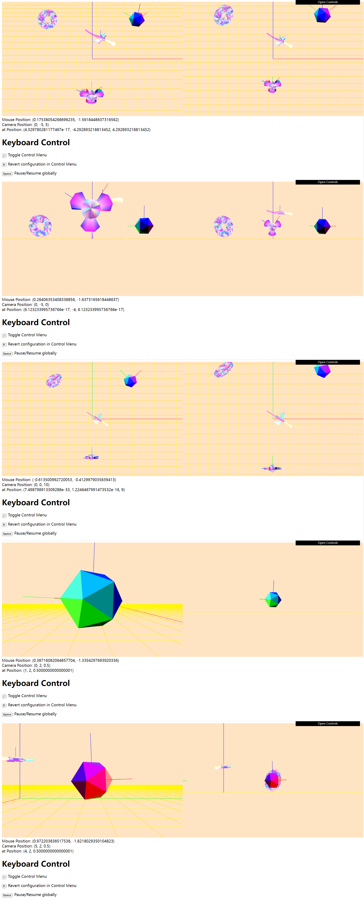

# Project B: The Ender Dragon flying around the Clover in 3D world

Name: Kuangzheng Zhang
NetID: KZQ6536

## User Guide

### Goal

The goal of this Project B is to build a 3D world with Ender Dragon , Clover (Both from my Project A), Torus (From 7.14jt.BasicShapesCam), Icosahedron and interact with it. The user can see through two different cameras: Perspective Camera and Orthographic Camera. The camera can be moved in three modes: ↑↓←→ (Aim camera in any direction without changing its position), WSAD (Move forward/backward in the gaze direction and strafe sideways left/right) and IKJL (Move along X/Z axis). The Icosahedron can be rotated by mouse dragging.

### Introduction

After completely loaded, the user will see randomly flying Ender Dragon, continuously swing Clover, continuously rotating Torus and stationary Iconsahedron.

#### Help

-   Instructions are presented under canvas
-   Click `Open Control` on the upper right of the web page or press `/` to open the Control Menu.
-   Some functions are shown in`Control Menu`-`Camera` and will be illustrated later

#### Control Menu

*Figure 1: Overall Config*

*Figure 2: Camera Config*

*Figure 3: Ender Dragon Config*

*Figure 4: Clover Config*

**Camera Config**: The user can activate Flying-Airplane Navigation Mode, use Preset Cameras to verify certain functions and customize Camera Parameters.

**Ender Dragon/Clover Config**: Each part can be configured independently. `Pause` is to pause and resume. `Clr` is to change its color. `Num` is to change the segments number of Tail/Stem/Petal. `Size` is to zoom in and out. `rotSpeed` is the rotation speed. `rotMinAngle` and `rotMaxAngle` is to define the range of rotation of Tail/Neck/Wing.

## Instruction

### Keyboard Control

- /: Toggle Control Menu
- R: Revert configuration in Control Menu
- Space: Pause/Resume globally

### Camera Control
1.  &#8593;, &#8595;, &#8592;, &#8594;: Aim camera in any direction without changing its position
2.  W, S, A, D: Move forward/backward in the gaze direction and strafe sideways left/right
3.  I, K, J, L: Move along X/Z axis

### Mouse Control

Drag & Move: Rotate the Icosahedron (Please choose different `Preset Cameras` like `Up`, `Front`, `Left`, `Right` in `Control Menu`-`Camera` to verify whether the rotation is correct).

## Results

### Screen Shots

*Figure 5: Initial State*

In the initial state, Torus, Ender Dragon and Clover are paused (`config.Env.Pause = true`)

*Figure 6: Attach Camera to Clover Stamen*

Enable `Control Menu`-`Camera`-`Attach` to attach the camera to the Clover Stamen. Choose `Look From Front` in `Control Menu`-`Camera`-`Preset Cameras` to get a better view. The camera will rotate as the Clover rotate.

*Figure 7: Flying-Airplane Navigation Mode*

Enable Flying-Airplane Navigation Mode by enabling `Control Menu`-`Camera`-`Flying-Airplane Navigation Mode`-`active`. The camera will rotate around Z-axis automatically and continuously. The user can change `rotSpeed` to accelerate/decelerate the rotation.

*Figure 8: Preset Cameras (Can be used to verify rotation)*

The user can choose several Preset Cameras in `Control Menu`-`Camera`-`Preset Cameras`. These cameras can be used to verify whether mouse drag & move to rotate Icosahedron (Mouse Control) is correct.

*Figure 9: User Adjustable Camera Parameters & Keyboard Control & No distortion when resizing the window*

**User Adjustable Camera Parameters**: The user can customize camera parameters when enabling `Control Menu`-`Camera`-`Customize Camara Parameters`-`Customize`. `fov` will be ignored in this function because the user will adjust `left`, `right`, `bottom`, `top`, `near`, `far`. Other parameters except `near` and `far` will be modified automatically when customizing one parameter to prevent distortion.

**Keyboard Control**: Please see Instruction Section

**No distortion when resizing the window**: The content will never squash/stretch as the user re-size window for taller or wider images of any size. And will never invoke browser horizontal slider-bar (vertical slider-bar will appear because user instruction in web page is a bit long).

### Scene Graph

*Figure 10: Scene Graph*